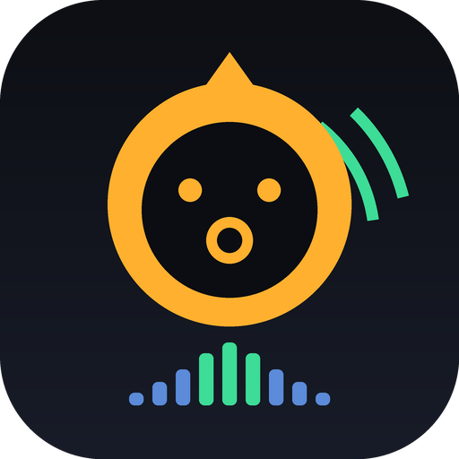

# Gibbon 🦧♪

A personal pocket sampler — record anything (especially the city), chop it onto pads, sequence a beat, perform mix FX, resample, export WAV. Original work inspired by the workflow of pocket samplers; no third-party code or assets. Offline, autosaves, free.

**Android:** grab `gibbon.apk` from [Releases → latest](../../releases/latest) on the phone, install (allow "unknown sources" once). Updates install over the top — same signing key, projects survive. Fully offline (**no INTERNET permission**).

**iOS / iPad:** open **https://almusallah.github.io/gibbon/** in Safari → Share → **Add to Home Screen**. Runs full-screen and offline (service worker), mic works, projects autosave on-device, WAV export goes through the share sheet. Same engine, same features.

## What it does

- **CHOP lab — field recording → slices** (v2): record a walk up to **6 minutes** (or import a long file), see the whole waveform, zoom/pan, tap to audition any slice, **AUTO-SLICE** detects sound events (sensitivity slider), GRID cuts equal divisions, drag markers to fine-tune (hold to delete), then **→ PADS** spreads the slices across empty pads to play with. Full recording can also go to a single pad or straight out as a WAV (city-sound archive). The recording survives app restarts.
- **64 pads** (4 banks × 16) — tap `●` then a pad to sample from the mic; `IMPORT` loads audio files
- **Per-pad editing** — trim with draggable handles, gain, pitch (±12 st), pan, one-shot/gate/loop, reverse, normalize, crop, choke groups, copy/paste
- **Keyboard mode** — play the selected pad chromatically or in a scale across the 16 pads
- **Sequencer** — 6 patterns × 16/32/64 steps, swing, live note-record (quantized), metronome, tap tempo
- **Song chain** — chain patterns and export the whole song
- **Performable mix FX** — LP/HP filter, tempo-synced delay, reverb, bitcrusher, rhythmic gate; hold + XY drag, or latch
- **Resample** — capture the master output (FX and all) back onto an empty pad
- **Export WAV** — loop, song, or single pad → straight into Downloads (16-bit stereo)
- **Projects** — autosave + named save slots, stored on-device (IndexedDB)

## Architecture

The instrument is a self-contained web app (`app/src/main/assets/www/`, Web Audio API + AudioWorklet capture/bitcrush) inside a minimal WebView shell that provides a secure origin, mic permission, the file picker, and a bridge that writes WAVs to `Downloads/` via MediaStore. CI builds and signs the APK on every push and publishes it to the `latest` release (keystore generated once by CI and committed back, so updates always match).

Dev loop on a laptop: serve `app/src/main/assets/www/` with any static server — the app runs in a normal browser (exports download instead of going to Downloads).
